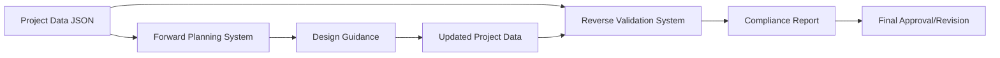

# Unified Input/Output Formats
## Forward Planning & Reverse Validation Systems

---

## 🔄 **SYSTEM ALIGNMENT**

Both the **Forward Planning System** and **Reverse Validation System** use **identical input/output formats** to ensure seamless integration and workflow continuity.

---

## 📥 **UNIFIED INPUT FORMAT**

### **Standard Project Data Structure**
Both systems expect the same JSON input format:

```json
{
  "project_info": {
    "project_name": "Smith Residence",
    "project_id": "PR-2025-001",
    "applicant_name": "John Smith",
    "architect": "ABC Architecture",
    "submission_date": "2025-09-16"
  },
  "site_data": {
    "zone_district": "R-1",
    "lot_area": 7500,
    "lot_width": 75,
    "lot_depth": 120,
    "lot_shape": "standard",
    "corner_lot": false,
    "flag_lot": false,
    "easements": [
      {
        "type": "utility",
        "width": 10,
        "location": "rear"
      }
    ]
  },
  "building_data": {
    "building_height": 28,
    "gross_floor_area": 3200,
    "floors": {
      "first_floor_area": 1800,
      "second_floor_area": 1400,
      "basement_area": 800,
      "attic_area": 200
    },
    "setbacks": {
      "front_setback": 25,
      "rear_setback": 30,
      "side_setback_left": 8,
      "side_setback_right": 10
    },
    "architectural_features": {
      "porches": [
        {
          "type": "front_porch",
          "area": 120,
          "height": 10,
          "covered": true
        }
      ],
      "bay_windows": [
        {
          "projection": 2,
          "width": 8,
          "floor": "first"
        }
      ]
    }
  },
  "parking_data": {
    "parking_spaces": 2,
    "covered_spaces": 2,
    "garage": {
      "type": "attached",
      "size": "2-car",
      "setback_from_street": 20
    },
    "driveway": {
      "width": 12,
      "length": 25,
      "slope": 8
    }
  },
  "accessory_structures": [
    {
      "type": "storage_shed",
      "area": 120,
      "height": 12,
      "setbacks": {
        "rear": 5,
        "side": 3
      }
    }
  ],
  "special_features": {
    "adu": {
      "present": false
    },
    "below_grade_patio": {
      "present": true,
      "area": 200,
      "depth": 4
    }
  }
}
```

---

## 📤 **UNIFIED OUTPUT FORMATS**

### **1. Forward Planning Output**

```json
{
  "planning_response": {
    "project_id": "PR-2025-001",
    "project_name": "Smith Residence",
    "planning_timestamp": "2025-09-16T20:50:51.451422",
    "workflow_phase": "Phase 2 - Building Design",
    "current_step": "2.1 Setback Planning",
    "status": "IN_PROGRESS",
    "guidance": {
      "current_requirements": [
        {
          "rule_id": "SB-1",
          "rule_title": "Front Setback Minimum",
          "requirement": "Front setback must be ≥ 20 feet",
          "current_value": null,
          "status": "PENDING",
          "guidance": "Design building with minimum 20 ft front setback"
        },
        {
          "rule_id": "SB-2", 
          "rule_title": "Rear Setback Minimum",
          "requirement": "Rear setback must be ≥ 25 feet",
          "current_value": null,
          "status": "PENDING",
          "guidance": "Ensure 25 ft minimum distance from rear property line"
        }
      ],
      "next_steps": [
        {
          "step": 1,
          "action": "Define building footprint within setback envelope",
          "required_inputs": ["building_data.setbacks"],
          "decision_point": "Proceed if all setbacks ≥ minimums"
        }
      ],
      "design_constraints": {
        "buildable_envelope": {
          "max_footprint_area": 4500,
          "setback_envelope": {
            "front_min": 20,
            "rear_min": 25,
            "side_min": 6
          }
        }
      }
    },
    "compliance_preview": {
      "anticipated_issues": [],
      "optimization_opportunities": [
        "Consider contextual front setback for neighborhood compatibility"
      ]
    }
  }
}
```

### **2. Reverse Validation Output**

```json
{
  "validation_response": {
    "project_id": "PR-2025-001",
    "project_name": "Smith Residence", 
    "validation_timestamp": "2025-09-16T20:50:51.451422",
    "overall_status": "COMPLIANT",
    "can_proceed": true,
    "summary": {
      "total_rules_checked": 45,
      "compliant_rules": 43,
      "violations": 2,
      "warnings": 0,
      "critical_violations": 0,
      "compliance_percentage": 95.6
    },
    "detailed_results": [
      {
        "rule_id": "SB-1",
        "rule_title": "Front Setback Minimum",
        "category": "setbacks",
        "status": "COMPLIANT",
        "criticality": "HIGH",
        "requirement": "Front setback must be ≥ 20 feet",
        "expected_value": "≥ 20 ft",
        "actual_value": "25 ft",
        "message": "Front setback 25 ft meets minimum 20 ft requirement",
        "stop_condition": false
      },
      {
        "rule_id": "FA-1",
        "rule_title": "Floor Area Ratio Maximum",
        "category": "floor_area",
        "status": "VIOLATION",
        "criticality": "MEDIUM",
        "requirement": "FAR must be ≤ 45%",
        "expected_value": "≤ 0.45",
        "actual_value": "0.47",
        "message": "FAR 0.47 (3200 sf / 6800 sf) exceeds maximum 0.45",
        "stop_condition": false,
        "remediation": {
          "options": [
            "Reduce gross floor area by 136 sf",
            "Apply for FAR variance"
          ],
          "priority": "MEDIUM"
        }
      }
    ],
    "phase_compliance": {
      "Phase 1 - Site Analysis": {
        "status": "COMPLIANT",
        "rules_checked": 8,
        "violations": 0
      },
      "Phase 2 - Building Design": {
        "status": "WARNING", 
        "rules_checked": 22,
        "violations": 2
      },
      "Phase 3 - Parking & Access": {
        "status": "COMPLIANT",
        "rules_checked": 10,
        "violations": 0
      },
      "Phase 4 - Special Features": {
        "status": "COMPLIANT",
        "rules_checked": 5,
        "violations": 0
      }
    }
  }
}
```

---

## 🔄 **WORKFLOW INTEGRATION**

### **Sequential Processing**
The systems work together using the same data structure:

```bash
# Step 1: Forward Planning
POST /api/v1/plan-project
Input: {project_data}
Output: {planning_response with guidance}

# Step 2: Design Development  
# (User updates project_data based on guidance)

# Step 3: Reverse Validation
POST /api/v1/validate-project  
Input: {updated_project_data}
Output: {validation_response with compliance status}

# Step 4: Iteration (if needed)
# If violations found, return to forward planning
```

### **Data Flow Consistency**



---

## 📊 **FIELD MAPPING & USAGE**

### **Input Field Usage by System**

| Field | Forward Planning | Reverse Validation | Required |
|-------|-----------------|-------------------|----------|
| `project_info.*` | Metadata only | Metadata only | Optional |
| `site_data.zone_district` | ✅ Rule selection | ✅ Rule application | **Required** |
| `site_data.lot_area` | ✅ Constraint calculation | ✅ Compliance check | **Required** |
| `site_data.lot_width` | ✅ Constraint calculation | ✅ Compliance check | **Required** |
| `site_data.lot_depth` | ✅ Constraint calculation | ✅ Compliance check | **Required** |
| `building_data.building_height` | ✅ Guidance generation | ✅ Height validation | **Required** |
| `building_data.gross_floor_area` | ✅ FAR calculation | ✅ FAR validation | **Required** |
| `building_data.setbacks.*` | ✅ Envelope definition | ✅ Setback validation | **Required** |
| `parking_data.parking_spaces` | ✅ Requirement calculation | ✅ Space validation | **Required** |
| `architectural_features.*` | ✅ Feature guidance | ✅ Feature validation | Optional |
| `accessory_structures.*` | ✅ Additional constraints | ✅ Structure validation | Optional |

### **Output Field Consistency**

Both systems provide:
- **Rule-level results** with same `rule_id` references
- **Compliance status** using same status values (`COMPLIANT`, `VIOLATION`, `WARNING`)
- **Criticality levels** using same scale (`HIGH`, `MEDIUM`, `LOW`)
- **Phase organization** using identical phase structure
- **Remediation guidance** in consistent format

---

## 🔧 **IMPLEMENTATION EXAMPLES**

### **Python Integration**
```python
# Same input for both systems
project_data = {
    "project_info": {...},
    "site_data": {...},
    "building_data": {...},
    "parking_data": {...}
}

# Forward Planning
from housing_planner import ForwardPlanner
planner = ForwardPlanner()
planning_result = planner.guide_project(project_data)

# Reverse Validation  
from reverse_compliance_validator import ReverseComplianceValidator
validator = ReverseComplianceValidator()
validation_result = validator.perform_comprehensive_validation(project_data)

# Same rule_ids in both outputs enable cross-referencing
```

### **API Integration**
```bash
# Both endpoints use identical input format
curl -X POST /api/v1/plan-project \
  -H "Content-Type: application/json" \
  -d @project_data.json

curl -X POST /api/v1/validate-project \
  -H "Content-Type: application/json" \  
  -d @project_data.json
```

### **Database Schema**
```sql
-- Single table stores data for both systems
CREATE TABLE projects (
    project_id VARCHAR(50) PRIMARY KEY,
    project_data JSONB,  -- Same structure for both systems
    planning_results JSONB,
    validation_results JSONB,
    current_phase VARCHAR(50),
    overall_status VARCHAR(20)
);
```

---

## ✅ **FORMAT BENEFITS**

### **1. Seamless Integration**
- **No data transformation** between systems
- **Consistent rule references** enable traceability
- **Unified APIs** simplify client integration

### **2. Workflow Continuity** 
- **Same project data** flows through entire lifecycle
- **Progressive enhancement** as design develops
- **Consistent validation** at each stage

### **3. Development Efficiency**
- **Shared data models** reduce code duplication
- **Common validation logic** ensures consistency
- **Unified testing** covers both systems

### **4. User Experience**
- **Single data entry** for both planning and validation
- **Consistent terminology** across all outputs
- **Predictable workflow** from planning to approval

This unified format approach ensures that the forward planning and reverse validation systems work together as a **cohesive compliance ecosystem** rather than separate tools, providing maximum value with minimal complexity.
